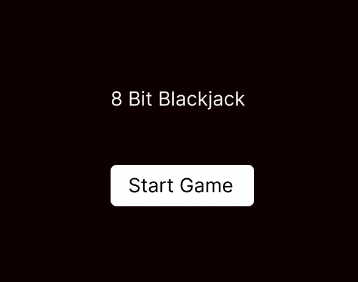
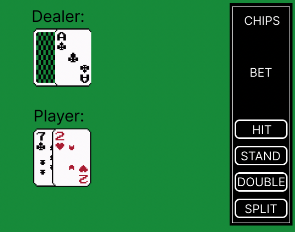

### Description

[LINK TO THE GAME](https://chuckchoiboi.github.io/8-bit-blackjack/)

This JavaScript game is an 8-bit version of a casino card game Blackjack. The game flow is created using async programming and object-oriented classes, and the graphic UI is created using [CreateJS](https://createjs.com/).

### Game Logic

The game is separated into multiple modules:

1. **game.js**
    - `game.js` is the main game logic that contains game states like `stage` (canvas), `backgroundMusic`, `player`, `dealer`, and `assets`. `index.html` waits for the game's custom font to load and starts the game script. game.js loads all the assets via `assetManager.js` module, and invokes `loadStartScreen` once all assets are loaded. Rest of the game logic utilizes the modules below.
2. **deckLogic.js**
    - `deckLogic.js` handles all the logics that are related to the card deck. It has utility functions to handle logics like shuffling of deck, return the value of the hand, drawing card, checking if a player is bust or has blackjack
3. **stage.js**
    - `stage.js` handles all the rendering logic using `create.js` library. The functions here mostly takes `game` parameter and renders graphic elements to the canvas in `game`.
4. **assetManager.js**
    - `assetManager.js` utilizes `create.js`'s `LoadQueue` class to preload all the assets like images and audios.
    - Loaded assets are accessible via `getAsset` function:
    ```
    getAsset: (name) => {
    	return assetManager.assets[name];
    },
    ```
5. **Player.js**
    - `Player.js` module contains both `Player` and `Dealer` classes. Each class has the player/dealer's `hand`, `handValue`, and `container` states. Container stores all graphic elements from stage.js
6. **Card.js**
    - `Card.js` module contains `Card` class that handles rendering of each cards.

### Wireframe




